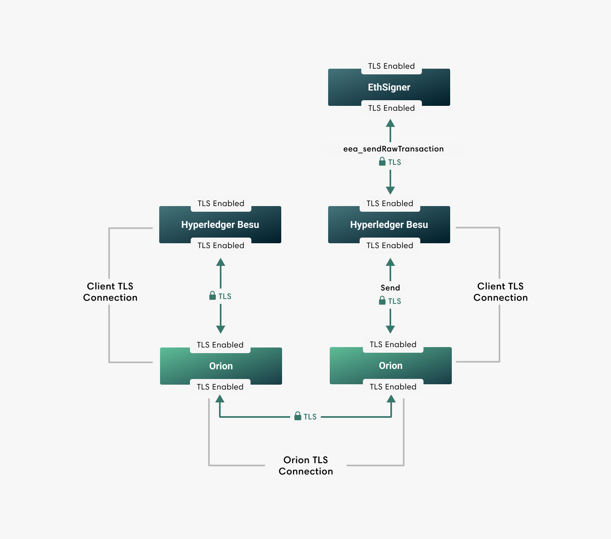

description: Orion TLS 
<!--- END of page meta data -->

# TLS Communication

Orion supports TLS to secure communication to a client
(for example Hyperledger Besu), and to other Orion nodes.

[The client (in this example, Hyperledger Besu) must be configured](https://besu.hyperledger.org/en/latest/HowTo/Configure/Configure-TLS/) to send and accept TLS communication between itself and Orion.

Use the configuration file options to
[enable and configure](../Tutorials/TLS.md) TLS.