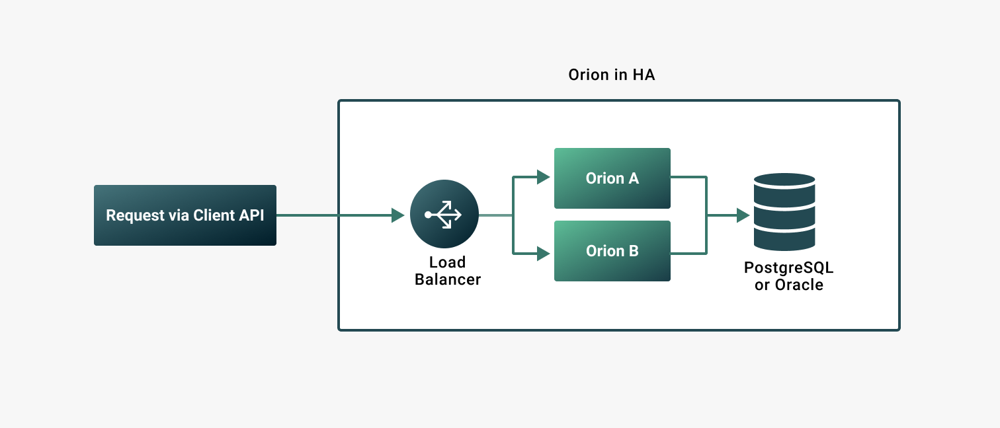

description: Orion deployment for high availability
<!--- END of page meta data -->

# High availability

Orion supports deploying more than one instance sharing the same backend stores.
By placing the instances behind a load balancer, downtime can be limited during maintenance operations.



## Storage

When configuring for high availability, both storage and known nodes storage must match so Orion
provides up to date information. Known nodes are discovered Orion nodes.

!!! tip
    Use the [`knownnodes`](../Reference/API-Methods.md#knownnodes) client API methods to retrieve the
    known nodes.

Use a relational database to enable highly available scenarios. Orion supports relational databases
[PostgreSQL](../Tutorials/Using-PostgreSQL.md) and [Oracle](../Tutorials/Using-Oracle.md).

Orion also supports LevelDB and MapDB stores. LevelDB and MapDB lock the local file system and
are not suitable for highly available scenarios.

For high availability, ensure the `storage` and `knownnodesstorage` in the [configuration file](../Reference/Configuration-File.md)
match for all Orion nodes.

## Load balancer configuration

The load balancer must expose both client and node interfaces.

When configuring for high availability, configure the nodes in the Orion cluster (Orion A and Orion B in the
above diagram) with the same set of keys and advertise the load balancer address.

!!! example "Nginx configuration with two Orion nodes"

    ```
     events { }

     http {
         upstream orion_8080 {
             server orion_1:8080 max_fails=3 fail_timeout=5s;
             server orion_2:8080 max_fails=3 fail_timeout=5s;
         }

         upstream orion_8888 {
             server orion_1:8888 max_fails=3 fail_timeout=5s;
             server orion_2:8888 max_fails=3 fail_timeout=5s;
         }

         server {
             listen 8080;

             location / {
                 proxy_pass http://orion_8080;
             }
         }

         server {
             listen 8888;

             location / {
                 proxy_pass http://orion_8888;
             }
         }
     }
    ```

The configuration defines two upstreams: `orion_8080` and `orion_8888`.

Both upstreams define health checks: `max_fails=3 fail_timeout=5s`

The [health checks](https://docs.nginx.com/nginx/admin-guide/load-balancer/http-health-check/) help
Nginx balance traffic among upstream servers.
